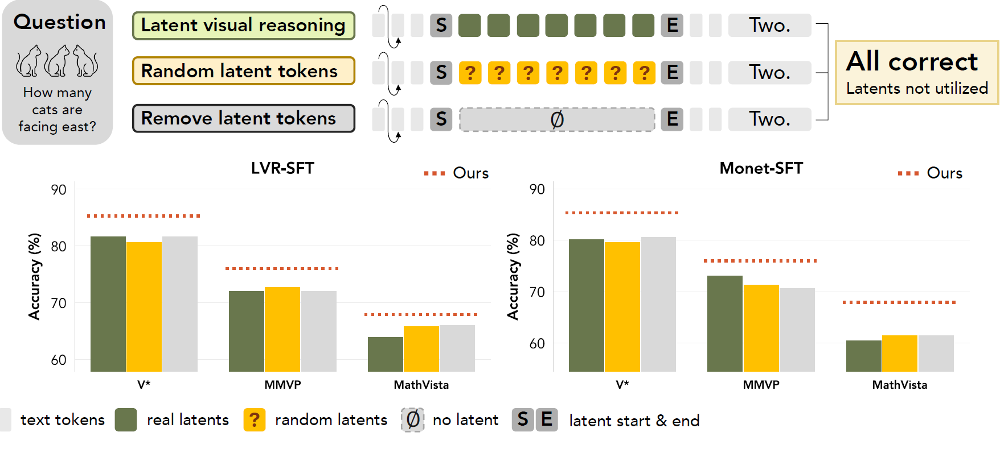

# Leveraging Latent Visual Reasoning in Silence

This repository contains the official implementation of **"Leveraging Latent Visual Reasoning in Silence."**

> Papar: [arxiv](https://arxiv.org/pdf/2605.18641)

> Code and models: [Hugging Face](https://huggingface.co/collections/cornuHGF/silent-lvr)

---

## Overview to the paper

<p align="center">
  
</p>

Latent visual reasoning models insert continuous latent tokens before textual generation to help multimodal models ground their answers in visual evidence. We find, however, that these latent tokens are **often not utilized** at inference: replacing them with random noise `export ABLATE_RANDOM_LATENT=1` or removing them entirely `export LATENT_SIZE=0` causes little performance degradation. Moreover, standard RL post-training (e.g., GRPO/VLPO) tends to **suppress latent generation entirely** over the course of training.

Rather than discarding latent reasoning, we argue its value lies in **how well latent tokens influence learning**, not whether they persist at inference. We propose an **attention-based reward** `export add_attn_to_reward=1` that encourages generated latent tokens to interact with subsequent text tokens during RL. This reward improves performance on visual reasoning and perception benchmarks, even when latent tokens are rarely generated after post-training.

**Key findings:**
- Latent tokens in existing models (Monet, LVR) can often be removed or randomized without hurting accuracy.
- RL post-training with outcome-only rewards drives models toward pure-text generation.
- Our attention-based reward improves visual grounding **in silence**: the model learns better even when it stops generating latent tokens at inference.
- Detailed experiment results can be found in our paper.

---

## 1. Setup environments

Clone and cd into this directory. Training requires 2 GPUs each of >= 80GB, or 4 GPUs each of >=40GB. 

Note: training monet requires transformers==4.51.3, and lvr requires 4.54.0.

```bash
# install uv
curl -LsSf https://astral.sh/uv/install.sh | sh
# set up train/eval environment, download data, download model
bash prepare_env.sh
```

You might need to manually add code for getting attn_weights to `Qwen2_5_VLSdpaAttention` and `Qwen2_5_VLFlashAttention2` in `Monet/RL/easyr1/lib/python3.11/site-packages/transformers/models/qwen2_5_vl/modeling_qwen2_5_vl.py`.

```python
with torch.no_grad():
    attn_weights = torch.matmul(query_states, key_states.transpose(2, 3)) / math.sqrt(self.head_dim)

    if attention_mask is not None:  # no matter the length, we just slice it
        causal_mask = attention_mask[:, :, :, : key_states.shape[-2]]
        attn_weights = attn_weights + causal_mask

    # Fix precision issues in Qwen2-VL float16 inference
    # Replace inf values with zeros in attention weights to prevent NaN propagation
    if query_states.dtype == torch.float16:
        attn_weights = torch.where(torch.isinf(attn_weights), torch.zeros_like(attn_weights), attn_weights)

    # upcast attention to fp32
    attn_weights = nn.functional.softmax(attn_weights, dim=-1, dtype=torch.float32).to(query_states.dtype)
    attn_weights = nn.functional.dropout(attn_weights, p=self.attention_dropout, training=self.training)
# return attn_output, attn_weights, past_key_value
```

## 2. Training

### Monet

#### training vlpo + attn (ours)

```bash
cd Monet/RL
bash examples/monet-rl-thymerl-attn1-latent0-includelatentsample1-kl0.01-temp0.5-rollout8-numgpu4.sh
```

#### training vlpo

```bash
cd Monet/RL
bash examples/monet-rl-thymerl-attn0-latent0-includelatentsample1-kl0.01-temp0.5-rollout8-numgpu4.sh
```

### LVR

Before training LVR, add the following patch to the `_MULTIMODAL_MODELS` in this file `xxx/site-packages/vllm/model_executor/models/registry.py` of vllm in your training environment (should be under `Monet/RL/easyr1`):

```python
    "QwenWithLVR": ("qwen2_5_vl", "Qwen2_5_VLForConditionalGeneration"),  # noqa: E501
```

#### training vlpo + attn (ours)

```bash
cd Monet/RL
bash examples/lvr-rl-thymerl-attn1-latent0-includelatentsample1-kl0.01-temp0.5-rollout8-numgpu4.sh
```

#### training vlpo

```bash
cd Monet/RL
bash examples/lvr-rl-thymerl-attn0-latent0-includelatentsample1-kl0.01-temp0.5-rollout8-numgpu4.sh
```

---

## 3. Pretrained Models

Pre-trained models are available on Hugging Face:

| Model | Description | Link |
|---|---|---|
| `monet-vlpo-attn` | Monet-SFT post-trained with VLPO + attention reward | [🤗](https://huggingface.co/cornuHGF/Monet-SFT-VLPO-Attn-600) |
| `monet-vlpo` | Monet-SFT post-trained with VLPO | [🤗](https://huggingface.co/cornuHGF/Monet-SFT-VLPO-600) |
| `lvr-vlpo-attn` | LVR-SFT* post-trained with VLPO + attention reward | [🤗](https://huggingface.co/cornuHGF/LVR-SFT-VLPO-Attn-400) |
| `lvr-vlpo` | LVR-SFT* post-trained with VLPO | [🤗](https://huggingface.co/cornuHGF/LVR-SFT-VLPO-400) |

---

## 4. Evaluation

### VLMEvalKit needs some patches.

<!-- Clone from [VLMEvalKit](https://github.com/open-compass/VLMEvalKit). Put under `Monet`. -->

Add the following patch for both LVR and Monet models to `Monet/VLMEvalKit/vlmeval/config.py` (please change `MODEL_SHORTNAME` and `PATH_TO_MODEL_CKPT_ACTOR_HUGGINGFACE` accordingly):

```python
monet_system_prompt="You are a helpful multimodal assistant. You are required to answer the question based on the image provided. Put your final answer in \\boxed{}."
latent_series = dict()
latent_series[MODEL_SHORTNAME] = partial( # e.g., monet-vlpo-attn-600
    Qwen2VLChat,
    model_path=PATH_TO_MODEL_CKPT_ACTOR_HUGGINGFACE,
    min_pixels=1280 * 28 * 28,
    max_pixels=8192 * 28 * 28,
    system_prompt=monet_system_prompt,
    use_vllm=True,
    gpu_utils=0.5,
)
supported_VLM.update(latent_series)
```

Add the following patch to the `_MULTIMODAL_MODELS` in this file `xxx/site-packages/vllm/model_executor/models/registry.py` of vllm in your eval environment (should be under `Monet/monet`):

```python
    "QwenWithLVR": ("qwen2_5_vl", "Qwen2_5_VLForConditionalGeneration"),  # noqa: E501
```

### Running evaluation

To evaluate Monet models:
```bash
HOME=xxx VLLM_WORKER_MULTIPROC_METHOD=spawn CUDA_VISIBLE_DEVICES=0 PYTHONPATH=. LATENT_START_ID=151666 LATENT_END_ID=151667 LATENT_SIZE=10 python run.py --judge exact_matching --reuse --data MathVista_MINI MathVerse_MINI MMVP MMBench_V11_MINI VStarBench MME-RealWorld-Lite HRBench4K --model MODEL_SHORTNAME
```

To evaluate LVR models:

```bash
HOME=xxx VLLM_WORKER_MULTIPROC_METHOD=spawn CUDA_VISIBLE_DEVICES=0 PYTHONPATH=. LATENT_START_ID=151665 LATENT_END_ID=151668 LATENT_SIZE=8 python run.py --judge exact_matching --reuse --data MathVista_MINI MathVerse_MINI MMVP MMBench_V11_MINI VStarBench MME-RealWorld-Lite HRBench4K --model MODEL_SHORTNAME
```

To use gemini as judge, use these args in the above:

```bash
GOOGLE_API_KEY=xxx ... python run.py --judge gemini-2.5-pro --judge-args "{\"retry\": 1,\"wait\": 1,\"verbose\": 1}"
```

To use deepseek as judge, use these args in the above:

```bash
--judge deepseek-v4-flash --judge-args "{\"retry\": 1,\"wait\": 1,\"verbose\": 1,\"api_base\":\"https://api.deepseek.com/chat/completions\",\"key\":\"sk-xxxxxxxx\"}"
```

---

## Acknowledgements

This work builds on [Monet](https://github.com/wangqixun/monet), [LVR](https://github.com/VincentLeebang/lvr), and [verl](https://github.com/volcengine/verl). Evaluation uses [VLMEvalKit](https://github.com/open-compass/VLMEvalKit). We thank the authors of these works for releasing their code and models.